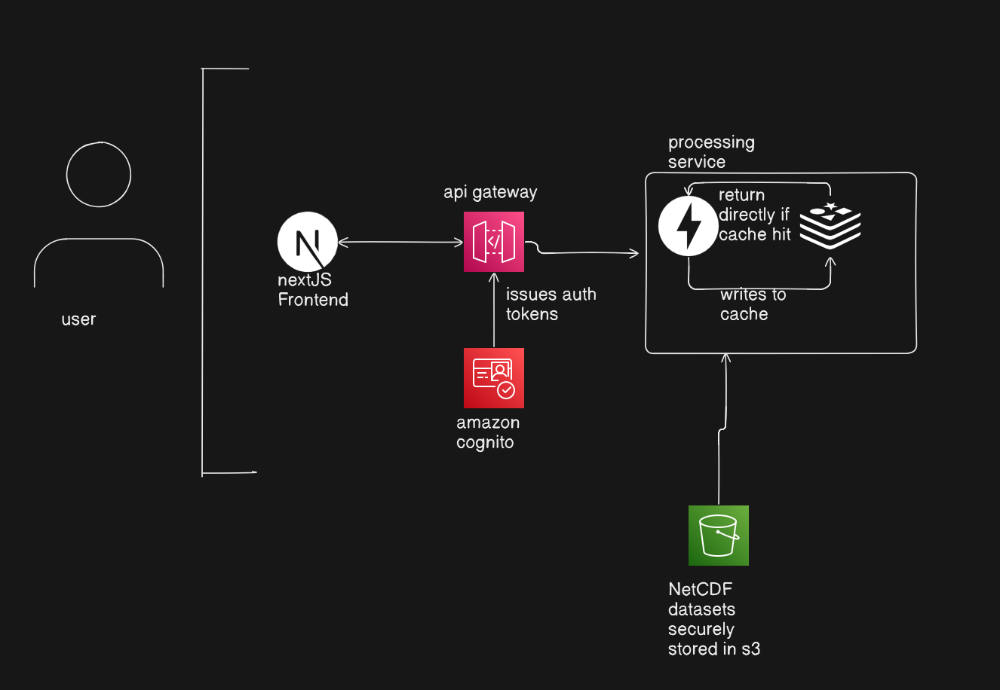
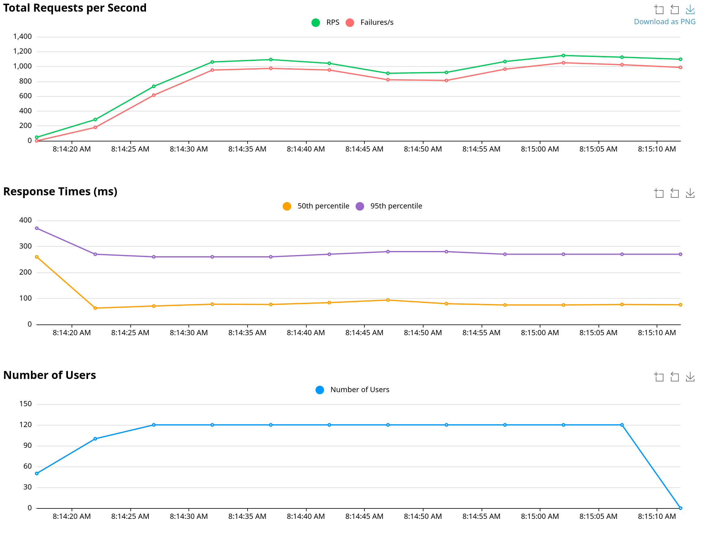
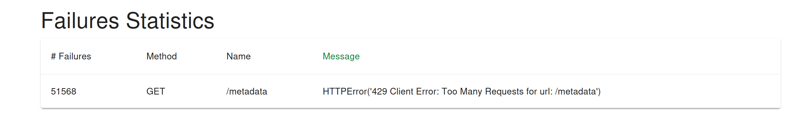

# 🌍 PyClimaExplorer

**Interactive Climate Data Exploration Platform**

PyClimaExplorer is a modern web platform that enables users to **explore large-scale climate datasets visually and interactively**.  
It transforms complex **NetCDF climate datasets** into intuitive spatial and temporal insights using an interactive dashboard and AI-powered summaries.

---
## DEMO VIDEO

## 🚀 Features

### 🌡 Climate Visualization
- Global **heatmap visualization**
- **3D interactive climate globe**
- Wind and anomaly visualization modes
- Climate state **comparison between timestamps**

### ⏱ Temporal Analysis
- Interactive timeline playback
- Time-series visualization for any selected geographic location

### 📍 Point Inspection
Click any location on the map or globe to:
- View local climate trends
- Analyze historical time series
- Understand variable changes over time

### 🧠 AI Climate Insights
AI-generated summaries help explain patterns and anomalies in the selected dataset.

### 🔊 Text-to-Speech Narration
AI insights can be **spoken aloud using browser-based TTS**, improving:
- accessibility
- usability
- engagement

### ⚡ High Performance
- Redis caching for frequently requested queries
- Efficient NetCDF slicing using scientific computing libraries

---

## 🧩 Problem Statement

Climate models generate large **NetCDF datasets** containing multi-dimensional variables such as temperature, precipitation, and wind speed.

While extremely valuable, these datasets are difficult to interpret without specialized tools.

PyClimaExplorer solves this by providing an **interactive visualization platform** that enables users to quickly explore spatial distributions and temporal trends.

---

## 🏗 Architecture

### Key Components

**Frontend**
- Next.js dashboard
- Interactive globe and map visualizations

**API Layer**
- Secure routing via API Gateway
- Rate limiting and authentication

**Backend**
- Climate data processing
- NetCDF slicing and analysis

**Caching**
- Redis for repeated queries

---

## 🌍 Dataset

The platform uses the **ERA5 Reanalysis Dataset**, which provides high-resolution global climate variables such as:

- Temperature
- Precipitation
- Wind speed
- Atmospheric pressure

Data is stored in **NetCDF format** and processed dynamically.

---

## ⚙ Tech Stack

### Frontend
- Next.js
- Deck.gl
- MapLibre
- Plotly
- Three.js

### Backend
- FastAPI
- Python
- Xarray
- NumPy
- Pandas

### Cloud Infrastructure
- AWS API Gateway (rate limit: 100 req/sec, spike: 200)
- Amazon Cognito (future prospect, skipped due to time constraint)
- Amazon S3
- Redis

### Visualization
- PyDeck
- Matplotlib
- Plotly

---

## 🔐 Security

Requests are routed through **AWS API Gateway**, while **Amazon Cognito** manages authentication and token issuance.

Benefits:
- Secure API access
- Rate limiting
- Scalable architecture

---

## 📊 Visualization Modes

| Mode | Description |
|-----|-------------|
| Heatmap | Global climate distribution |
| Globe | 3D earth visualization |
| Wind | Wind pattern visualization |
| Anomaly | Climate anomaly detection |
| Compare | Compare two timestamps |

---

## 🧪 Example Workflow

1. Select a climate variable  
2. Choose a date and time  
3. View global climate heatmap or 3D globe  
4. Click any location to inspect time-series data  
5. Listen to AI-generated climate insights  

---

## ⚡ Performance Optimizations

- Redis caching
- Efficient NetCDF processing with Xarray
- Cloud-based dataset storage
- API rate limiting via API Gateway

---
## 🌎 Future Improvements

- AI-driven climate predictions
- Satellite imagery overlays
- Advanced anomaly detection
- Multi-dataset comparison
- Collaborative climate analysis tools
 
--- 
## LOCUST LOAD TEST RESULTS (demonstration of API gateway rate limiting)

Load testing was performed using **Locust** to simulate concurrent users accessing the API through AWS API Gateway. The results demonstrate the effectiveness of the gateway's rate limiting configuration. While the system generated over **1000 requests per second**, excess traffic was automatically throttled by API Gateway, returning **HTTP 429 (Too Many Requests)** responses before reaching the backend.

Latency metrics remained stable during the test. The **p50 latency (~70–90 ms)** represents the median response time experienced by most users, while the **p95 latency (~260–280 ms)** shows the response time for the slowest 5% of requests. The relatively small gap between these values indicates that the system maintains consistent performance even under heavy load. This demonstrates that API Gateway successfully protects the backend from overload while keeping response times predictable.
